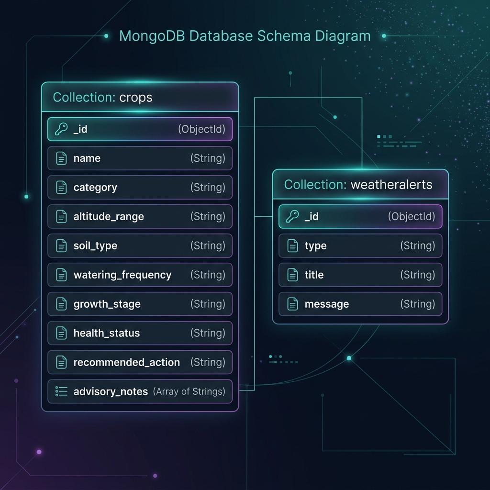
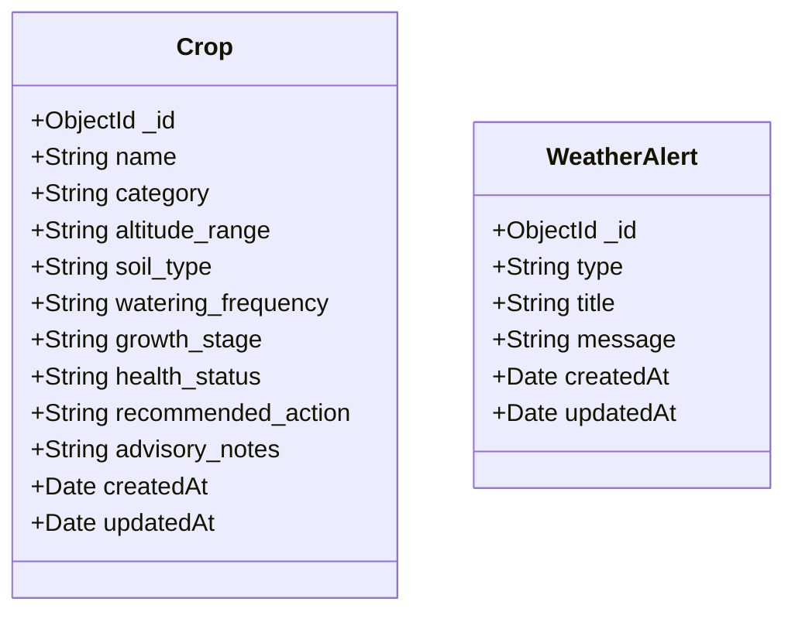

# AI-Powered Crop Advisory Chatbot for Uttarakhand Mountain Farmers

## Overview

The AI-Powered Crop Advisory Chatbot is a smart agricultural assistance platform designed for farmers in Uttarakhand's mountain regions. It provides crop recommendations, disease diagnosis, pest management guidance, and farming advice through an easy-to-use conversational interface.

The goal of this project is to help farmers make informed decisions, improve crop productivity, and access agricultural knowledge more efficiently.

## Features

* AI-powered farming assistance
* Crop recommendation system
* Plant disease diagnosis
* Pest management suggestions
* Weather-based farming advice
* Government scheme information
* Interactive chatbot interface
* Responsive and mobile-friendly design
* Multi-language support (planned)

## Tech Stack

### Frontend

* React.js
* Tailwind CSS
* React Router
* Vite

### Backend

* Node.js (Native HTTP — zero external dependencies)
* REST API with full CRUD endpoints

### Database

* MongoDB with Mongoose (ODM) for data persistence.

### AI Integration

* OpenAI API

### Deployment

* Vercel
* Render

## Project Structure

```text
AI-Powered-Crop-Advisory-Chatbot-for-Uttarakhand-Mountain-Farmers/
│
├── frontend/
│   ├── src/
│   │   ├── components/
│   │   ├── pages/
│   │   ├── assets/
│   │   └── App.jsx
│   │
│   └── package.json
│
├── backend/
│   ├── server.js                                  ← Node.js REST API
│   ├── .env.example                               ← Environment variable template
│   ├── .gitignore
│   ├── package.json
│   └── Crop_Advisory_API_Collection.postman_collection.json
│
└── README.md
```

## Installation

### Clone the Repository

```bash
git clone https://github.com/ajayrawat07/AI-Powered-Crop-Advisory-Chatbot-for-Uttarakhand-Mountain-Farmers.git
cd AI-Powered-Crop-Advisory-Chatbot-for-Uttarakhand-Mountain-Farmers
```

### Frontend Setup

```bash
cd frontend
npm install
npm run dev
```

### Backend Setup

```bash
cd backend
npm install
node seed.js    # Populates initial mock data into MongoDB
node server.js  # Starts backend server
```

The backend will start at `http://127.0.0.1:5000`.

---

## Database Integration & Choice

We use **MongoDB** with **Mongoose** (ODM) for storing the application data.

### Why MongoDB?
1. **Flexible, Document-Oriented Schema**: The crop advisory data contains nested fields, variable text sizes (advisory notes and recommended actions), and agricultural metadata. MongoDB's JSON-like document model naturally fits this structure without complex SQL joins.
2. **Horizontal Scalability**: Perfect for growing regional datasets across Uttarakhand's different terrains and weather stations.
3. **Mongoose Middleware & Modeling**: Mongoose simplifies schema definition, validation, and JSON serialization.

### Database Schema Diagram

Below is the database design visual:





## How to Set Up the Database

1. **Install MongoDB**: Ensure you have MongoDB running locally (default port `27017`) or have a remote MongoDB Atlas URI.
2. **Configure `.env`**: Make sure your `.env` file in the `backend/` directory specifies your `MONGO_URI` connection string, e.g.:
   ```
   MONGO_URI="mongodb://localhost:27017/crop_advisory"
   ```
3. **Install Dependencies**: Run `npm install` inside the `backend` folder to install `mongoose`.
4. **Seed Database**: Execute the seeding script to populate the database with default crop and weather alert data:
   ```bash
   node seed.js
   ```

---

## How to Run Backend Locally

### Prerequisites

* [Node.js](https://nodejs.org/) v18 or higher installed
* No additional packages required (zero external dependencies)

### Steps

1. **Clone the repository**

   ```bash
   git clone https://github.com/ajayrawat07/AI-Powered-Crop-Advisory-Chatbot-for-Uttarakhand-Mountain-Farmers.git
   cd AI-Powered-Crop-Advisory-Chatbot-for-Uttarakhand-Mountain-Farmers
   ```

2. **Navigate to the backend folder**

   ```bash
   cd backend
   ```

3. **Create your `.env` file from the example**

   ```bash
   copy .env.example .env
   ```

   Edit `.env` if you need a different port:

   ```
   PORT=5000
   HOST=127.0.0.1
   ENV=development
   ```

4. **Start the server**

   ```bash
   node server.js
   ```

5. **Verify it is running** — open your browser or Postman and visit:

   ```
   http://127.0.0.1:5000/
   ```

   You should see:

   ```json
   {
     "status": "online",
     "message": "Welcome to the AI-Powered Crop Advisory Backend for Uttarakhand Farmers!"
   }
   ```

### Available API Endpoints

| Method | Endpoint | Description |
|--------|----------|-------------|
| GET | `/` | API health check |
| GET | `/api/crops` | List all crops (supports `?category=` & `?health_status=` filters) |
| GET | `/api/crops/:id` | Get a single crop by ID |
| GET | `/api/crops/search?q=` | Search crops by name, category, or notes |
| POST | `/api/crops` | Create a new crop record |
| PUT | `/api/crops/:id` | Update an existing crop record |
| DELETE | `/api/crops/:id` | Delete a crop record |
| GET | `/api/weather` | Get weather alerts for Uttarakhand |
| POST | `/api/chat` | AI crop advisory chatbot |

### Testing with Postman

Import the collection file into Postman:

```
backend/Crop_Advisory_API_Collection.postman_collection.json
```

All 9 requests are pre-configured with saved example responses.

---

## Future Enhancements

* Image-based disease detection
* Voice-enabled chatbot
* Market price prediction
* Weather forecasting integration
* Personalized farming recommendations
* Regional language support

## Author

Ajay Rawat

MCA Student | Full-Stack Developer Aspirant

## Project Status

Currently Under Development
